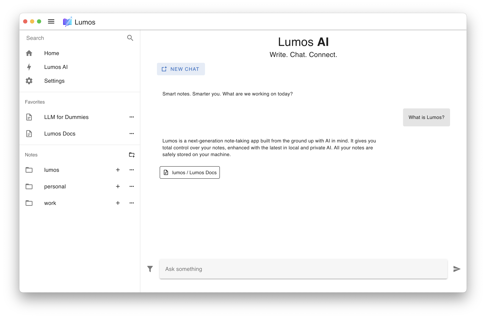
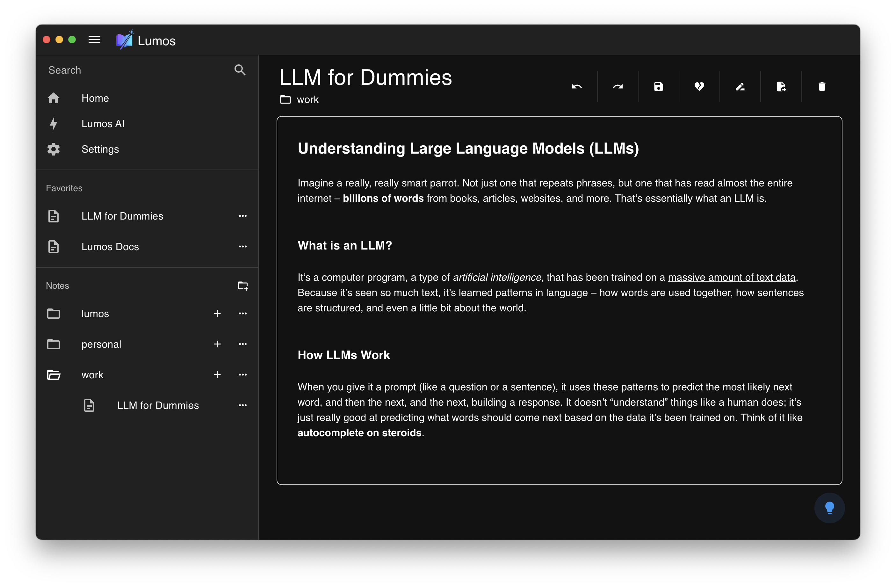

# ✨ Lumos: your notes, your way

<p align="center">
  
</p>

**Lumos** is a next-generation note-taking app, **built from the ground up with AI in mind**. Forget cloud lock-in and complex UI. Lumos gives you total control over your notes, enhanced with the latest in local and private AI. All your notes, all your ideas, safely on your machine.

## 🖼️ Screenshots
<p align="center">
  <h3 align="center">Home</h3>
  
  <h3 align="center">Note View / Editor</h3>
  
  <h3 align="center">Note Editor Tools</h3>
  
  <h3 align="center">Lumos AI Chat</h3>
  
  <h3 align="center">Dark Theme</h3>
  
  <h3 align="center">Brainstorm with AI Tool</h3>
  
</p>


## 🚀 Features

- **Organize Notes Your Way**  
  Group notes into folders for easy organization.

- **Rich Formatting**  
  Format and style your notes to make them truly yours.

- **AI Brainstorming**  
  Stuck on an idea? Let Lumos AI suggest topics or expand your thoughts.

- **AI Editing & Explanations**  
  Ask AI to explain, summarize, or rewrite any section of your text.

- **Instant Formatting with AI**  
  Instantly format, style, or change the tone (professional, casual, etc.) of your notes using AI.

- **Multilingual Support**  
  Translate your notes into any language—powered by AI.

- **Summarize, Expand, Fix Grammar**  
  Let AI tidy up, summarize, or expand your ideas with one click.

- **Private & Local by Default**  
  All notes are stored locally. No forced cloud. Your data, your choice.

- **Local or Hosted AI Models**  
  Run LLMs and embedding models locally via [Ollama](https://ollama.com/), or connect your own API key for hosted models if you wish.

- **Chat with Your Notes**  
  Search, explore, or chat directly with your notes via Lumos AI—powered by local vector search.


## 🌟 Why Lumos?

Notion and other modern note apps are great, but they often tie your data to their cloud or are overloaded with features. **Lumos was born from a need for:**

- **True data ownership:** Your notes never leave your device unless you want them to.
- **Simplicity & speed:** Clean, minimal UI. Everything just works.
- **Local AI:** All AI features are local-first (and offline!), or you can use hosted models with your own keys.
- **Material-inspired Design:** A beautiful, distraction-free writing experience.


## 🛠️ Tech Stack

- **Electron** for cross-platform desktop experience
- **Vue 3** frontend (Material-inspired, minimal & clean)
- **SQLite** for storing notes
- **LanceDB** for fast local vector storage and search
- **LangChain** for AI/LLM integrations
- **Ollama** for local LLM/embeddings (plug-and-play local inference)
- **Optional:** Connect your own OpenAI (or similar) API key for hosted models


## 🖥️ Prerequisites

1. **Install [Ollama](https://ollama.com/download)**
2. Pull the `snowflake-arctic-embed2` embeddings model with:  
   ```bash
   ollama pull snowflake-arctic-embed2
   ```
    > This is needed to locally generate embeddings for your notes.

3. Pull one or more LLMs. You will be able to choose in Lumos which to use!

## 💡 Getting Started

1. **Clone this repo**
2. Run `npm install`
3. Start the app with `npm run dev`
4. Add your LLM model via Ollama, or provide your API key for remote models.
5. Take notes, organize, and let Lumos AI supercharge your workflow—privately.


## 🙋‍♂️ Who’s Behind Lumos?

**Davide Cocca** — [LinkedIn](https://it.linkedin.com/in/davide-cocca-5b6b661a1)

I'm a software engineer passionate about open source, AI, and building technology that empowers users and protects their privacy.

Lumos started as a side project—built to offer a simple, local, and AI-powered note-taking experience as an alternative to Notion, without relying on the cloud.


## 📣 Contributing

Pull requests and ideas are welcome!  
Check out the [CONTRIBUTING.md](CONTRIBUTING.md) (coming soon) for guidelines.


## 🪄 License

MIT License. See [LICENSE](LICENSE) for details.


## ⭐️ Try Lumos Today!

Take back control of your notes—powered by local, private, and personal AI.
