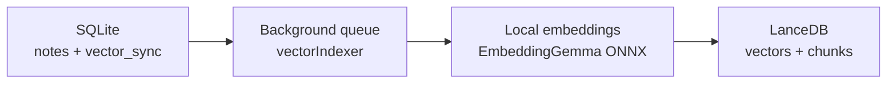

# Lumos RAG: Embeddings & Semantic Retrieval

How Lumos turns notes into vectors, keeps the index in sync, and uses it to
answer questions in chat. Everything described here runs **fully offline** on
the user's machine — no note content ever leaves the device.

---

## 1. Overview

Lumos has two independent search systems:

| System                | Engine                   | Purpose                             |
| --------------------- | ------------------------ | ----------------------------------- |
| Keyword search (FTS)  | SQLite full-text search  | Exact word matching                 |
| Semantic search (RAG) | EmbeddingGemma + LanceDB | Meaning-based retrieval for AI chat |

The RAG pipeline is composed of four pieces:



- **Source of truth**: notes live in SQLite (`notes` table). Vectors are a
  derived, disposable cache that can be rebuilt at any time.
- **Saves never wait on embeddings**: a save resolves as soon as SQLite
  commits; indexing happens in the background afterwards.
- **Non-fatal by design**: if the embedding model fails to load, Lumos still
  opens; semantic features simply report themselves as unavailable.

---

## 2. The embedding model

- **Model**: [EmbeddingGemma 300M](https://huggingface.co/google/embeddinggemma-300m)
  from Google DeepMind, ONNX conversion of `onnx-community/embeddinggemma-300m-ONNX`.
- **Quantization**: Q4 (~209 MB on disk), loaded with Transformers.js +
  ONNX Runtime **inside the Electron main process** (`src/main/services/localEmbeddings.js`).
- **Output**: one 768-dimension vector per text input.
- **Provisioning**: the binary model is not committed to git. It is pinned by
  revision and checksums in `scripts/embedding-model.lock.json` and fetched
  into gitignored `resources/models/embeddinggemma-300m-onnx/` with:

    ```bash
    npm run fetch:model
    ```

    At runtime Lumos looks for the model first in `process.resourcesPath/models`
    (packaged installs via `extraResources`), then in `resources/models`
    (development).

- **Offline guarantee**: `env.allowRemoteModels = false` — embeddings can never
  touch the network.
- **License notice**: bundled under `resources/licenses/NOTICE-embeddinggemma.txt`
  (Gemma Terms of Use).

### Retrieval prompt prefixes

EmbeddingGemma expects task prefixes to separate queries from documents:

- Query: `task: search result | query: <text>`
- Document: `title: <note title> | text: <chunk>`

The document prefix is stored _with_ each chunk and stripped again when
results are read back, so callers only ever see original note text.

> ⚠️ Changing either prefix, the model, its quantization, or chunking changes
> the entire vector space. That's what the index manifest (§4) protects.

---

## 3. Indexing pipeline

### Chunking

Note content is split with LangChain's `RecursiveCharacterTextSplitter`:

- chunk size: **512** characters
- overlap: **64** characters

Each chunk is embedded together with the note title (via the document prefix),
which improves retrieval for short chunks.

### Storage (LanceDB)

Vectors are stored in a local LanceDB database at
`<userData>/lancedb`, table `notes_embeddings`, using cosine distance:

- each row: `{ text, source (= note id), vector }`
- per-note delete/replace: rows are filtered by `source = '<noteId>'`

### The background queue (`src/main/services/vectorIndexer.js`)

A single-process FIFO queue, one note at a time:

1. Any note save or rename calls `vectorIndexer.requestIndex(noteId)` after the
   SQLite commit resolves.
2. Repeated requests for the same note coalesce — the note is processed once,
   re-read fresh from SQLite right before embedding ("latest state wins").
3. Per note: delete old vectors → embed + insert new chunks → mark synced.
4. Jobs are spaced 250 ms apart so typing-heavy sessions never saturate the CPU;
   failures retry up to 3 times with backoff.
5. Deleted notes / empty notes have their vectors removed instead of indexed.

Queue progress is broadcast to all windows as `rag-status` events and surfaced
in Settings → AI (RAG card).

### Sync tracking (`vector_sync` table)

Crash-safety comes from a tiny SQLite table rather than trusting the vector DB:

```sql
CREATE TABLE vector_sync (
  note_id INTEGER PRIMARY KEY,
  synced_at TEXT NOT NULL
);
```

After a successful index pass, the row records the note's `updated_at`. On the
next startup, reconciliation re-queues every note where:

- no `vector_sync` row exists (never indexed), or
- `synced_at < updated_at` (edited since last index).

This means a crash mid-index loses nothing: the next launch simply finishes the
job. Notes deleted between runs drop their stale rows.

---

## 4. The index manifest & automatic rebuilds

`<userData>/lancedb/index_manifest.json` records the "shape" of the index:

```json
{
    "modelId": "onnx-community/embeddinggemma-300m-ONNX",
    "revision": "5090578d9565bb06545b4552f76e6bc2c93e4a66",
    "dimension": 768,
    "quantization": "q4",
    "chunkSize": 512,
    "chunkOverlap": 64
}
```

At startup this is compared against the values compiled into
`src/main/database/vectorStore.js`. On mismatch (e.g. Lumos ships a new model),
the whole table is dropped, an empty one is created, the manifest is rewritten,
and every note is re-indexed automatically through the normal background queue.
No manual migration is ever required from users.

---

## 5. Retrieval & RAG chat

Semantic search is exposed to the renderer via IPC
(`search-similar-notes`, preload: `window.api.searchSimilarNotes`):

1. The query is embedded with the query prefix.
2. LanceDB performs cosine similarity search, over-fetching by ×3.
3. Results are cleaned up:
    - document prefix stripped from chunk text,
    - empty chunks dropped,
    - anything with cosine distance > **0.70** discarded (relevance floor),
    - trimmed to the requested limit (default 5).

In the note chat panel (`LumosChatPanel.vue`) it is used like this:

1. Take the user's message as the query, `limit = 3`.
2. In _note_ scope, filter results to `source = <activeNoteId>`; in global
   scope, search all notes.
3. Concatenate the returned chunks into a context block.
4. Build the LLM prompt (`chatRagPrompt(context)`) and stream the answer.
5. Collect the `source` note ids of the used chunks and fetch those notes so
   the answer can cite them.

If the vector store isn't ready, `search-similar-notes` throws and the chat UI
reports semantic search as unavailable — keyword search keeps working.

---

## 6. Manual rebuild & status API

Settings exposes two IPC endpoints for maintenance:

| IPC              | Effect                                                          |
| ---------------- | --------------------------------------------------------------- |
| `rag-get-status` | `{ ready, error, indexing, pending, indexedCount, totalNotes }` |
| `rag-rebuild`    | Clears all `vector_sync` rows and re-queues every note          |

Use rebuild after changing embedding-related settings, if the index is suspected
corrupt, or after bulk-importing notes while the app was closed.

---

## 7. File map

| File                                                  | Role                                                                |
| ----------------------------------------------------- | ------------------------------------------------------------------- |
| `scripts/fetch-embedding-model.mjs`                   | Downloads the pinned ONNX model                                     |
| `scripts/embedding-model.lock.json`                   | Pins revision + SHA-256 checksums                                   |
| `src/main/services/localEmbeddings.js`                | Model loading, batching, prefix-free raw embedding                  |
| `src/main/database/vectorStore.js`                    | LanceDB schema, manifest, add/delete/search, prefixes               |
| `src/main/services/vectorIndexer.js`                  | Background queue, retries, reconcile/rebuild, status                |
| `src/main/database/crud.js`                           | Save hooks calling `requestIndex`; `vector_sync` queries            |
| `src/main/database/db.js`                             | Creates the `vector_sync` table                                     |
| `src/main/main.js`                                    | Startup init (non-fatal), IPC handlers, `rag-status` broadcast      |
| `src/main/preload.js`                                 | Safe renderer API surface (`searchSimilarNotes`, `getRagStatus`, …) |
| `src/rendered/components/chat/LumosChatPanel.vue`     | RAG chat consumer                                                   |
| `src/rendered/components/settings/LumosAIRagCard.vue` | Status + rebuild UI                                                 |
