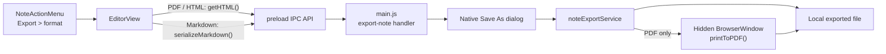

# Note Export Flow

Lumos exports the active note as PDF, Markdown, or standalone HTML. Export is
available only from the editor action menu so it always uses the live Tiptap
document, including unsaved edits.

## Renderer Serialization

`EditorView` receives the format selected in `NoteActionMenu` and passes the
current editor content through the secure IPC bridge in `src/main/preload.js`.

- **PDF and HTML** use `editor.getHTML()`.
- **Markdown** uses `serializeMarkdown()` from
  `src/rendered/services/noteExport.js`, which maps Lumos's Tiptap nodes and
  marks to Markdown. The note title is written as an H1.

## Main-Process Export

`src/main/main.js` validates the IPC payload and opens a native Save As dialog
with the extension and filter for the selected format. It then delegates to
`src/main/services/noteExportService.js`.

The service:

- Sanitizes the note title for the default filename.
- Wraps exported HTML in a standalone, styled document with the note title.
- Writes Markdown and HTML directly to the selected local path.
- Generates PDFs in a hidden, sandboxed Electron `BrowserWindow` using
  `webContents.printToPDF()`, then destroys that temporary window.

Export is entirely local. It does not send note content to a remote service.
